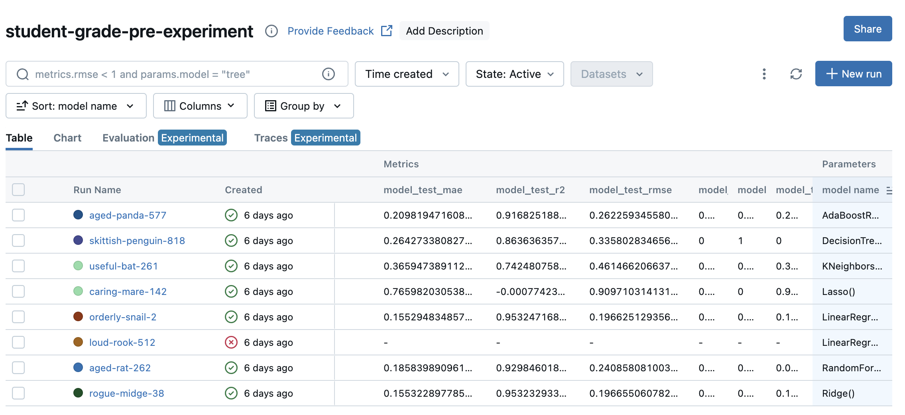

# End to End MLOPs Project on Predicting Student Grade.

## Problem Statement - Business Use Case
The dataset contains comprehensive information on around 2,000 high school students, detailing their demographics, study habits, parental involvement, extracurricular activities, and academic performance. The target variable, GradeClass, classifies students' grades into distinct categories, providing a robust dataset for educational research, predictive modeling, and statistical analysis.

In this project, given the student details, we predict the GradeClass for student. The top features generated by our Machine Learning Model can help parents identify the key areas they should focus for their kids improvement to help their kid achieve greater academic success. 

## Data Science Approach
We perform following MLOPs practices to achieve a robust solution.
* Train a model on that dataset tracking our experiments
* Create a model training pipeline
* Deploy the model in batch, web service or streaming
* Monitor the performance of your model
* Follow the best practices.

## EDA
Exploratory Data Analysis for the data can be found in notebook/eda_student_performance.ipynb notebook. 

## Model Training
We trained various machine learning model and Linear Regression is the best model, indicating that the decision function is linear and signal present in data is not that much complex.
Model Training experiments can be found in notebook/model_training.ipynb notebook. 
We have logged model perfomance in mlflow, the code for same can be found in following notebook:- experiment-tracking/model_training.ipynb

We can observe from the below SnapShot of Model results that Linear Regression has best R2-Score on Test set.

## Model Orchestration 
We use Prefect for model orchestration.

## Reproducing this notebook
1. Install all the dependencies present in requirements.txt
2. To run the MLFlow type the below comman in terminal after navigating inside experiment-tracking directory.
    mlflow ui --backend-store-uri sqlite:///mlflow.db
3. Run this notebook experiment-tracking/model_training.ipynb to train various models and log the metrics in mlflow database.

## Future Steps/Improvements

